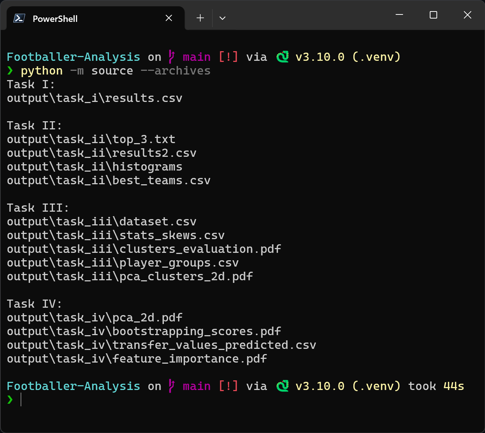

# Football Players Data Analysis
    
A school project involves collecting and analyzing football players statistical data from the 2024-2025 Premier League.

The data is scraped from [FBREF](https://fbref.com/en/comps/9/2024-2025/2024-2025-Premier-League-Stats/) and [FOOTBALL TRANSFERS](https://www.footballtransfers.com/en/values/players/most-valuable-players/playing-in-uk-premier-league). 

Outputs directories are displayed on terminal. Total runtime should be around 3 minutes (hopefully).

## Dependencies
- [**Python 3.10.0**](https://www.python.org/downloads/release/python-3100/)
- [**selenium**](https://pypi.org/project/selenium/) - Get Websites' Sources
- [**beautifulsoup4**](https://pypi.org/project/bs4/) - Parse HTML
- [**pandas**](https://pypi.org/project/pandas/) - Data Manipulation
- [**matplotlib**](https://pypi.org/project/matplotlib/) - Plotting Histograms And Graphs
- [**scikit-learn**](https://pypi.org/project/scikit-learn/) - Machine Learning

## Installation

1. Clone Repo:
    ```bash
    git clone https://github.com/Ka-raS/School-Assignment-1.git
    cd School-Assignment-1
    ```

2. Install Package Dependencies:
    ```bash
    pip3 install -r requirements.txt
    ```

    Alternatively, if you want to install packages in the latest version
    ```bash
    pip3 install selenium beautifulsoup4 pandas matplotlib scikit-learn
    ```

3. Run Program:
    ```bash
    python3 -m source
    ```

    Alternatively, this will scrape from the archives and produce similar results like in the report
    ```bash
    python3 -m source --archives
    ```

Additionally, you can compile report.tex through [MikTex](https://miktex.org/download), it has no package dependencies.
    ```bash
    cd reports
    pdflatex report.tex
    ```

## Screenshot

<div align="center">
  
</div>
